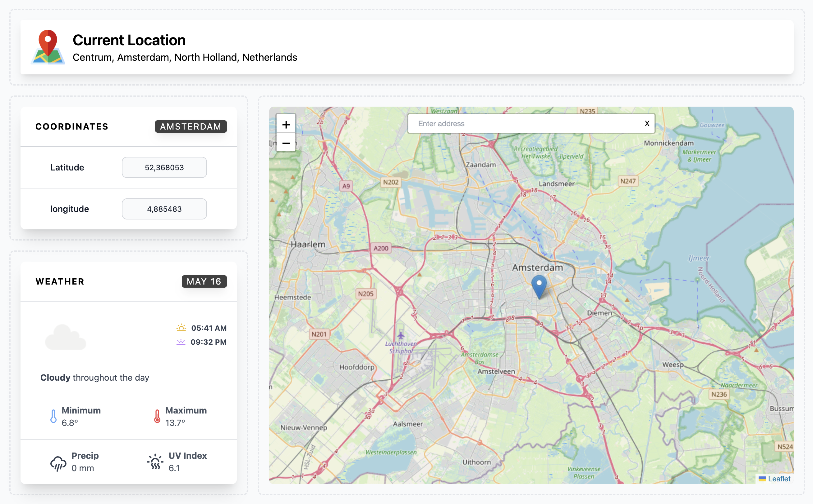

# Local Weather App

Local Weather App is a weather application that allows users to view real-time weather information based on their locations.

## Technologies Used
Vue.js - JavaScript-based front-end framework.   
Leaflet - Library for interactive maps.   
Axios - Promise-based HTTP client.   
Tailwind CSS - Utility-first CSS framework.   

## Demo

You can find a live demo of the application [here](https://weather.recaicakiroglu.com).

## Screenshots




## Getting Started

### Prerequisites

To run the WeatherApp locally, you need to have the following installed on your system:

- Node.js (v12 or higher)
- npm (v6 or higher)

### Installation

1. Clone the repository:
```
git clone https://github.com/recaicakiroglu/weatherapp.git
```
2. Navigate to the project directory:
```
cd weatherapp
```
3. Install the dependencies:
```
npm install
```

### Compiles and hot-reloads for development
```
npm run serve
```

Open your browser and visit http://localhost:8080 to access the application.


### Compiles and minifies for production
```
npm run build
```

## Contributing
Contributions are welcome! If you have any suggestions, bug reports, or feature requests, please open an issue on the GitHub repository.

## License
This project is licensed under the MIT License.
